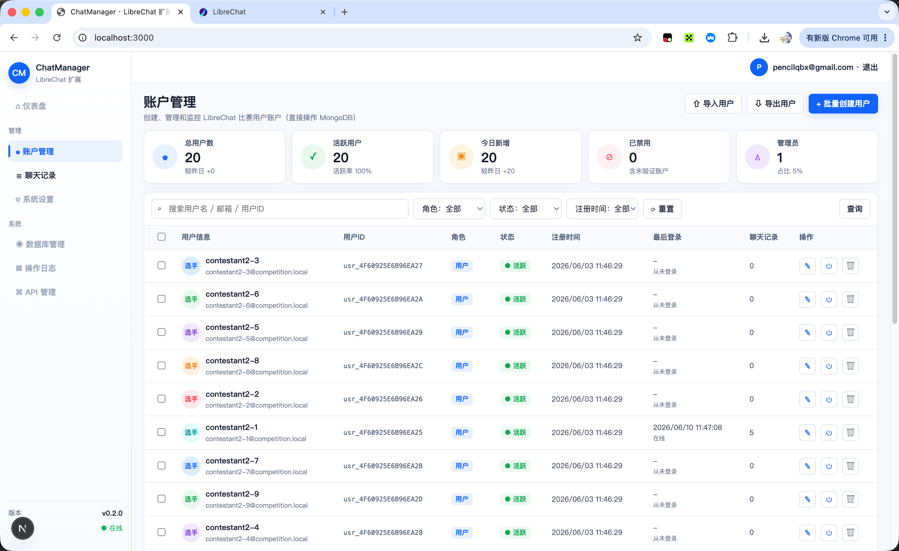
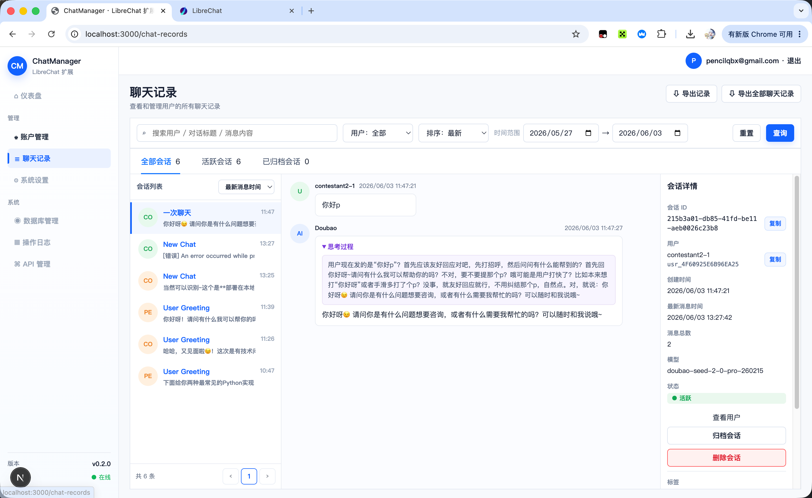

# 目录

`/LibreChat` 原LibreChat项目

`/ChatManager` LibreChat扩展功能项目

# 启动！！！

### 原Libre项目

创建数据库
```shell
docker run -d --name chat-mongodb -p 27017:27017 mongo:8.0.20
```
安装依赖
```shell
cd LibreChat
cp .env.example .env
npm run smart-reinstall
```
启动原Libre后端
```shell
cd LibreChat
npm run backend:dev
```
启动原Libre前端
```shell
cd LibreChat
npm run frontend:dev
```

### 扩展功能项目（ChatManager）

安装依赖
```shell
cd ChatManager
cp .env.example .env
npm install
```

启动（前后端不分离，默认 http://localhost:3000）
```shell
cd ChatManager
npm run dev
```

主要能力：
- 批量创建比赛账号（bcrypt 密码，可立即登录 LibreChat）
- 用户列表 / 搜索 / 禁用 / 删除 / 导入导出 CSV
- 聊天记录三栏管理（会话列表 / 消息详情 / 会话元数据），直连 `conversations` 与 `messages` 集合

### 扩展功能项目测试

集成测试（真实调用 API，并查询 MongoDB 验证结果）
```shell
cd ChatManager
npm run build
npm run test:integration
```

测试默认使用独立数据库，避免污染真实 LibreChat 数据：
```shell
mongodb://127.0.0.1:27017/ChatManagerTest
```

测试文件：
- `tests/integration/auth.test.mjs`：认证与静态管理 token
- `tests/integration/users-list-update.test.mjs`：用户查询、禁用、session 清理、封禁记录、审计日志
- `tests/integration/users-bulk-create.test.mjs`：批量创建用户、密码 hash、审计日志
- `tests/integration/chat-records.test.mjs`：聊天记录查询、详情、归档、删除、审计日志
- `tests/integration/helpers/test-server.mjs`：测试服务、MongoDB、API 请求封装
- `tests/integration/helpers/fixtures.mjs`：测试数据 fixture

### 可选操作

刷新缓存（登陆限流后可以使用）
```shell
npm run flush-cache
```

# 功能展示
**用户管理界面**


**对话管理界面**


**禁用账号**


**批量生产账号**


**导出全部聊天记录**

